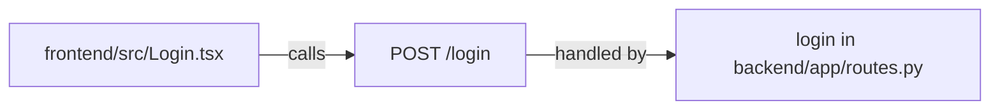

# API interactions

```mermaid
flowchart LR
  n1["frontend/src/Login.tsx"]
  n2["login in backend/app/routes.py"]
  n3["POST /login"]
  n1 -->|calls| n3
  n3 -->|handled by| n2
```

## Evidence

- [backend/app/routes.py:7](../backend/app/routes.py#L7)
- [frontend/src/Login.tsx:6](../frontend/src/Login.tsx#L6)
